# WSL Dashboard

<p align="center">
  
</p>

Een modern, krachtig, lichtgewicht en geheugenzuinig dashboard voor het beheren van WSL-instanties (Windows Subsystem for Linux). Gebouwd met Rust en Slint voor een premium native ervaring.

---

```diff
Mededeling:

- WSL Dashboard wordt niet verspreid via de Microsoft Store.
- Elke applicatie die daar onder de naam "WSL Dashboard" wordt vermeld, is niet geautoriseerd en kan vals zijn.
- Gelieve het niet te downloaden om mogelijke oplichting te voorkomen.
```

---

<p align="left">
  <a href="https://www.rust-lang.org" target="_blank"></a>
  <a href="https://slint.dev" target="_blank"></a>
  <a href="https://tokio.rs" target="_blank"></a>
  <a href="https://github.com/microsoft/windows-rs" target="_blank"></a>
  <a href="../LICENSE"></a>
  <a href="https://hellogithub.com/repository/owu/wsl-dashboard" target="_blank"></a>
</p>

I18N :  [English](../README.md) | [简体中文](./README_zh_CN.md) | [繁體中文](./README_zh_TW.md) | [हिन्दी](./README_hi.md) | [Español](./README_es.md) | [Français](./README_fr.md) | [العربية](./README_ar.md) | [বাংলা](./README_bn.md) | [Português](./README_pt.md) | [Русский](./README_ru.md) | [اردو](./README_ur.md) | [Bahasa Indonesia](./README_id.md) | [Deutsch](./README_de.md) | [日本語](./README_ja.md) | [Türkçe](./README_tr.md) | [한국어](./README_ko.md) | [Italiano](./README_it.md) | Nederlands | [Svenska](./README_sv.md) | [Čeština](./README_cs.md) | [Ελληνικά](./README_el.md) | [Magyar](./README_hu.md) | [עברית](./README_he.md) | [Norsk](./README_no.md) | [Dansk](./README_da.md) | [Suomi](./README_fi.md) | [Slovenčina](./README_sk.md) | [Slovenščina](./README_sl.md) | [Íslenska](./README_is.md) | [Tiếng Việt](./README_vi.md) | [తెలుగు](./README_te.md) | [Basa Jawa](./README_jv.md) | [ภาษาไทย](./README_th.md) | [தமிழ்](./README_ta.md) | [Filipino](./README_fil.md) | [ਪੰਜਾਬੀ](./README_pa.md) | [Bahasa Melayu](./README_ms.md) | [Polski](./README_pl.md) | [Українська](./README_uk.md) | [فارسی](./README_fa.md) | [ಕನ್ನಡ](./README_kn.md) | [मराठी](./README_mr.md) | [Hausa](./README_ha.md) | [မြန်မာ](./README_my.md) | [Oʻzbek](./README_uz.md) | [Azərbaycan](./README_az.md) | [Cebuano](./README_ceb.md) | [മലയാളം](./README_ml.md) | [سنڌي](./README_sd.md) | [አማርኛ](./README_am.md)

---

## 📑 Inhoudsopgave
- [🌍 Ondersteunde talen](#-ondersteunde-talen)
- [🚀 Belangrijkste kenmerken & Gebruik](#-belangrijkste-kenmerken--gebruik)
- [⚙️ Configuratie & Logboeken](#️-configuratie--logboeken)
- [🖼️ Screenshots](#️-screenshots)
- [🎬 Demonstratie](#-demonstratie)
- [💻 Systeemvereisten](#-systeemvereisten)
- [📦 Installatiehandleiding](#-installatiehandleiding)
- [🛠️ Tech Stack & Prestaties](#️-tech-stack--prestaties)
- [🤝 Community Steun](#-community-steun)
- [❤️ Ondersteun dit project](#️-ondersteun-dit-project)
- [⭐️ Liefdeswerk](#️-liefdeswerk)
- [📄 Licentie](#-licentie)

---

## 🌍 Ondersteunde talen

Engels, Vereenvoudigd Chinees, Traditioneel Chinees, Hindi, Spaans, Frans, Arabisch, Bengaals, Portugees, Russisch, Urdu, Indonesisch, Duits, Japans, Turks, Koreaans, Italiaans, Nederlands, Zweeds, Tsjechisch, Grieks, Hongaars, Hebreeuws, Noors, Deens, Fins, Slowaaks, Sloveens, IJslands, Vietnamees, Telugu, Javaans, Thais, Tamil, Filipijns, Punjabi, Maleis, Pools, Oekraïens, Perzisch, Kannada, Marathi, Hausa, Birmaans, Oezbeeks, Azerbeidzjaans, Cebuano, Malayalam, Sindhi, Amhaars.

<p align="left">
  
  
  
  
  
  
  
  
  
  
  
  
  
  
  
  
  
  
  
  
  
  
  
  
  
  
  
  
  
  
  
  
  
  
  
  
  
  
  
  
  
  
  
  
  
  
  
  
  
  
</p>


## 🚀 Belangrijkste kenmerken & Gebruik

- **Moderne Native UI**: Intuïtieve GUI met ondersteuning voor Donkere/Lichte modus, vloeiende animaties en hoogwaardige rendering aangedreven door **Skia**.
- **Systeemvak-integratie (Tray)**: Volledige ondersteuning voor minimaliseren naar het systeemvak (geheugengebruik ~10 MB), dubbelklikken om te schakelen en een functioneel rechtsklikmenu.
- **Intelligente Startup**: Configureer het dashboard om met Windows te starten, te minimaliseren naar het systeemvak (stille modus met `/silent`), en distributies automatisch af te sluiten bij het afsluiten.
- **Uitgebreid beheer**: Start, Stop, Beëindig en Verwijder registratie met één klik. Realtime statusbewaking en gedetailleerd inzicht in schijfgebruik en bestandslocaties.
- **Distro beheer**: Instellen als standaard, migratie (VHDX verplaatsen naar andere schijven), en exporteren/klonen naar `.tar` of `.tar.gz` archieven.
- **Snelle integratie**: Direct starten in Terminal, VS Code of Verkenner met aanpasbare werkmappen en startup script-hooks.
- **Distributie-installatie**: Installeer Linux-distributies via Microsoft Store, GitHub, lokale bestanden (RootFS/VHDX) of online mirrors (met automatische snelheidstest om de snelste mirror te kiezen en ingebouwde RootFS download-helper).
- **Veiligheid**: Mutex-locks voor veilige gelijktijdige migratie-/backup-operaties en automatische opschoning van Appx bij verwijdering.
- **Ultra-laag geheugengebruik**: Sterk geoptimaliseerd voor efficiëntie. Stille startup (systeemvak) gebruikt slechts **~10 MB** RAM. Gebruik in venstermodus varieert per fontcomplexiteit: **~18 MB** voor standaardtalen en **~38 MB** voor talen met grote tekensets (Chinees, Japans, Koreaans).
- **Geavanceerde netwerken**: Naadloos beheer van port forwarding (met automatische aanmaak van firewallregels) en wereldwijde HTTP-proxyconfiguratie voor geünificeerde connectiviteit.
- **USB-apparaatbeheer**: Volledige integratie met `usbipd-win` voor het moeiteloos binden, aankoppelen en beheren van lokale USB-apparaten in al uw WSL-instanties direct vanaf het dashboard.


## ⚙️ Configuratie & Logboeken

Alle configuratie wordt beheerd via de Instellingen-weergave:

- Kies de standaard installatiemap voor nieuwe WSL-instances.
- Configureer de logmap en het logniveau (Error / Warn / Info / Debug / Trace).
- Kies de UI-taal of laat deze de systeemtaal volgen.
- Schakel donkere modus in/uit en stel in of de app WSL automatisch mag afsluiten na operaties.
- Configureer hoe vaak de app op updates controleert (dagelijks, wekelijks, tweewekelijks, maandelijks).
- Schakel automatisch starten bij systeemopstart in (met automatisch padherstel).
- Stel de app in om bij opstarten te minimaliseren naar het systeemvak.
- Stel de sluitknop in om te minimaliseren naar het systeemvak in plaats van af te sluiten.
- Pas de zijbalk aan door de zichtbaarheid van specifieke functietabbladen in of uit te schakelen.

Logbestanden worden naar de geconfigureerde logmap geschreven en kunnen worden bijgevoegd bij het melden van problemen.


## 🖼️ Screenshots

### Home (Lichte & Donkere modus)
<p align="center">
  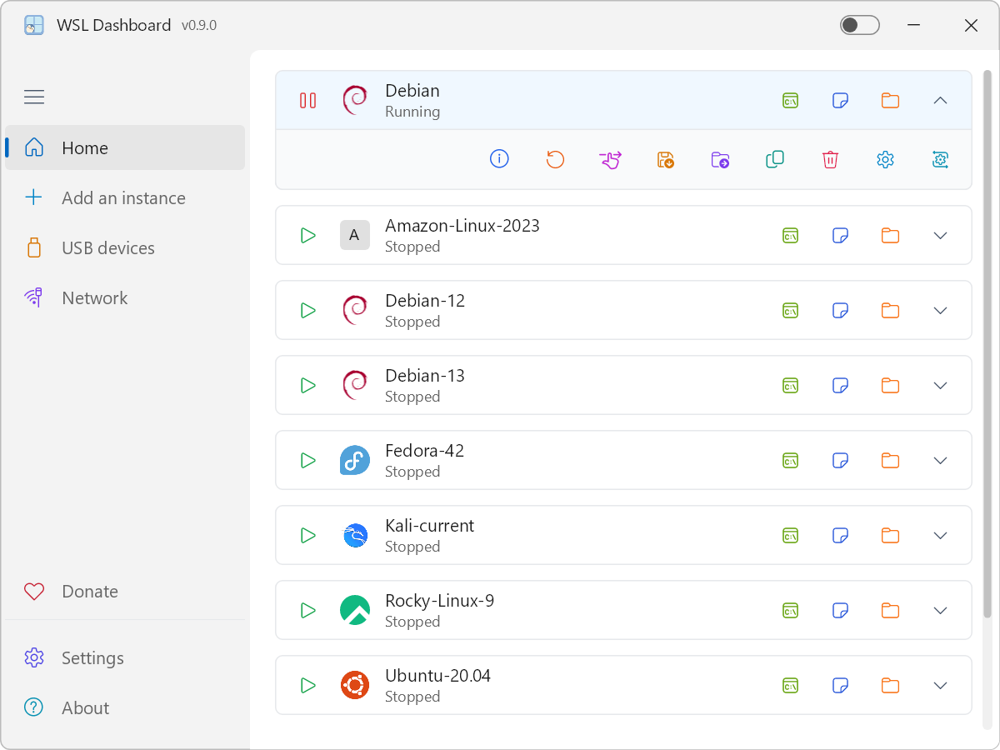
  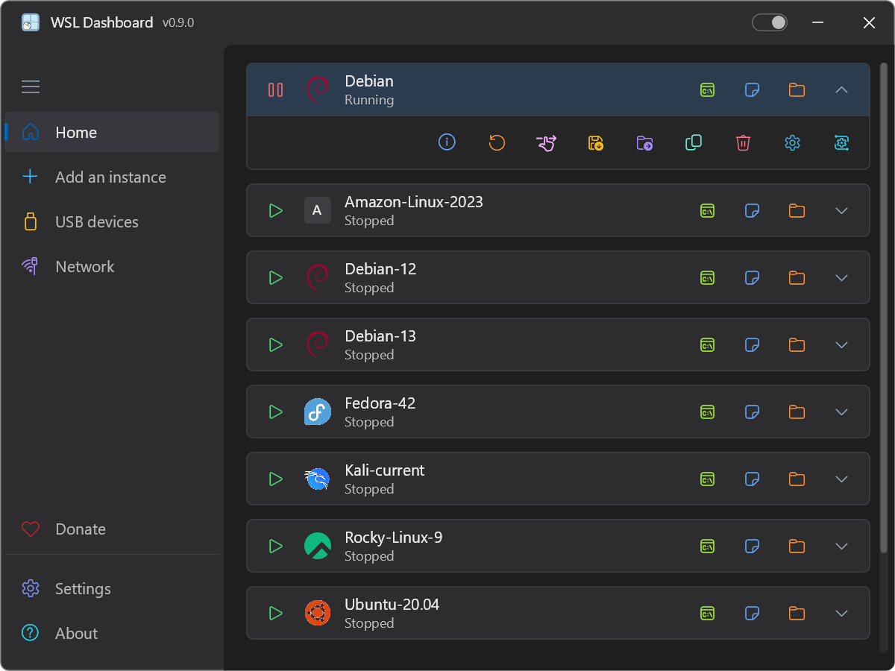
</p>

<p align="center">
  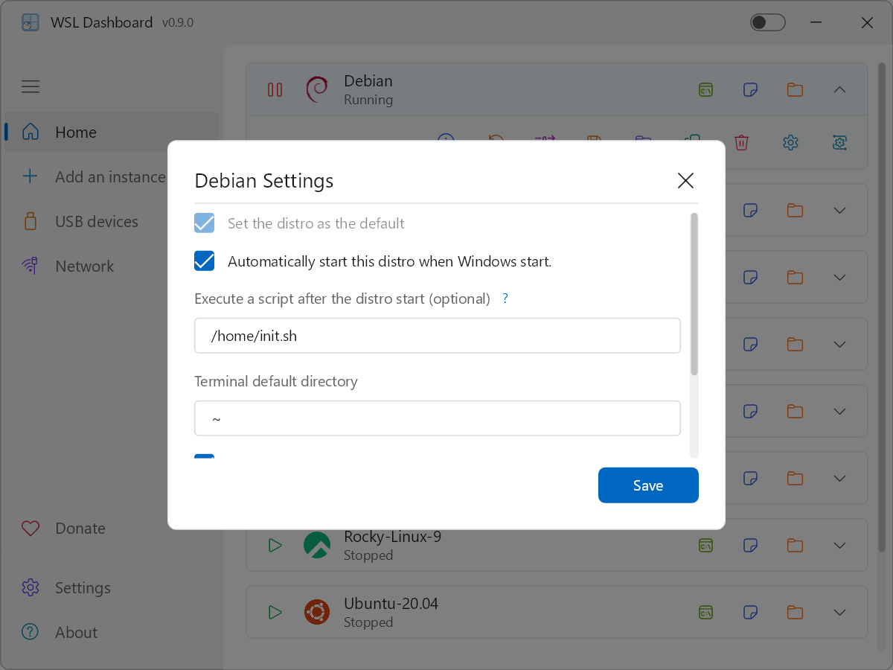
  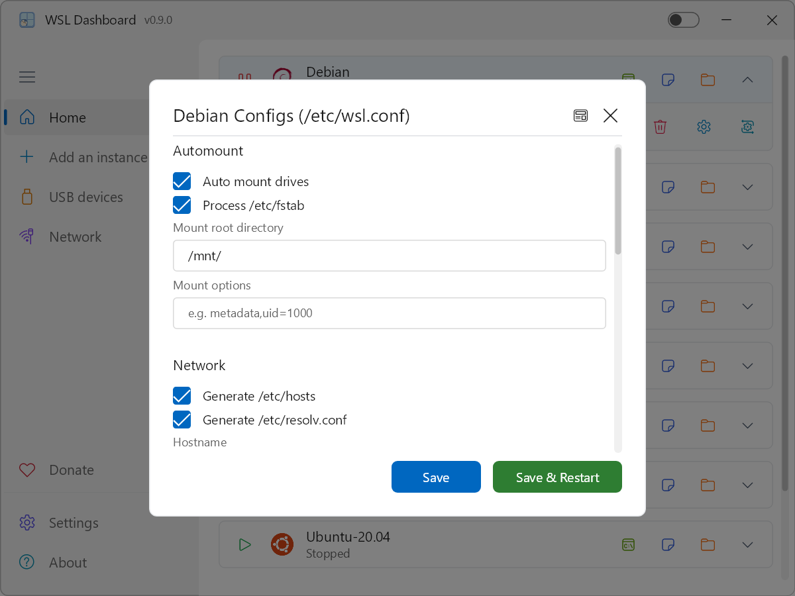
</p>

### USB & menu inklappen
<p align="center">
  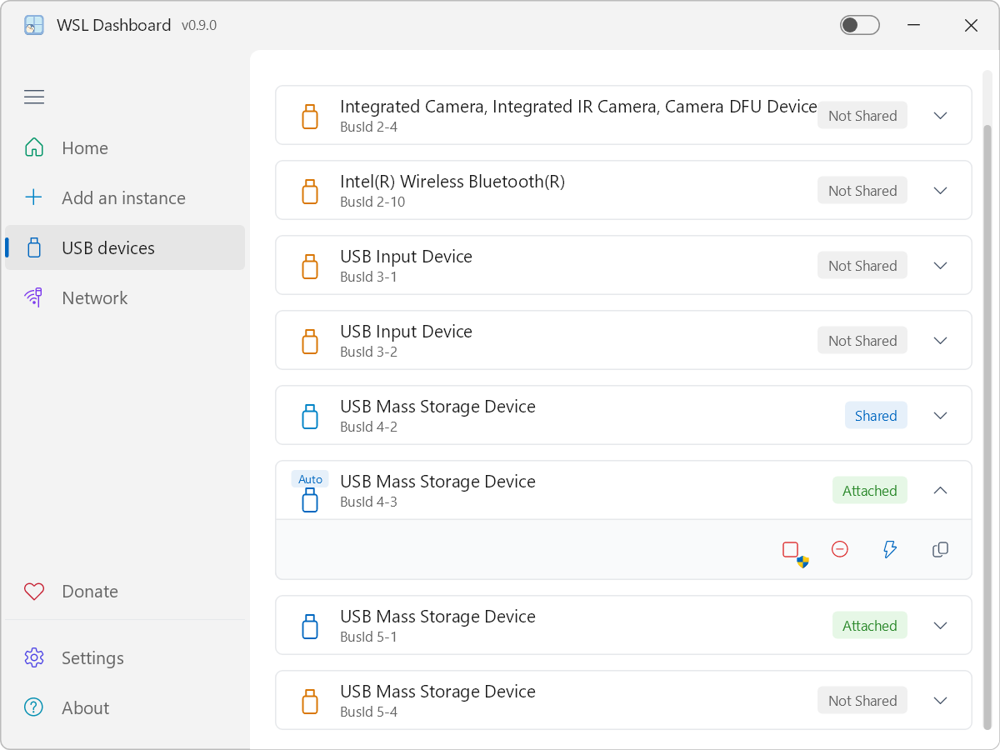
  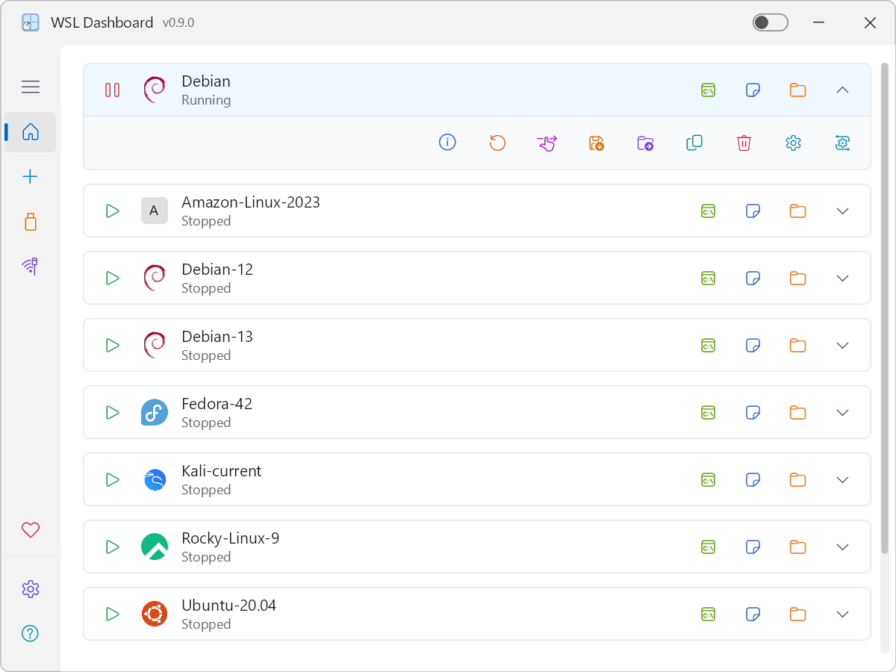
</p>

### netwerk
<p align="center">
  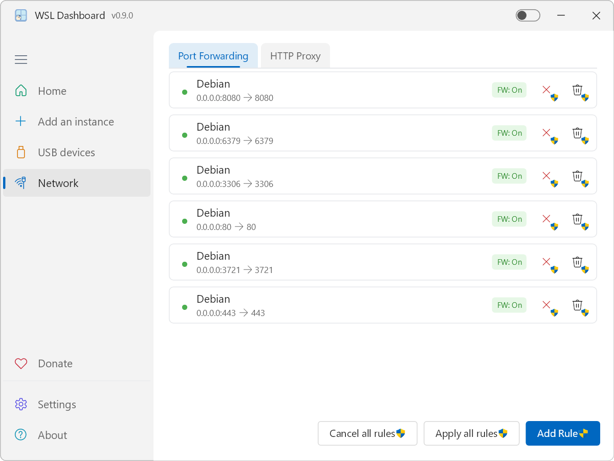
  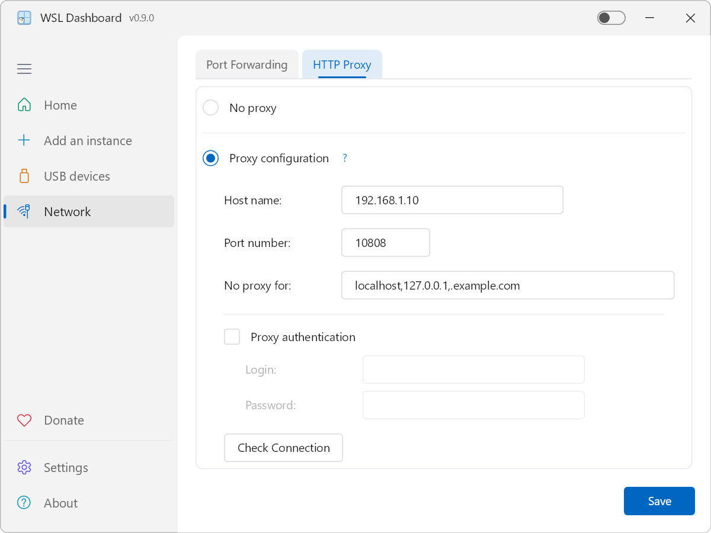
</p>

### Instance toevoegen & Instellingen
<p align="center">
  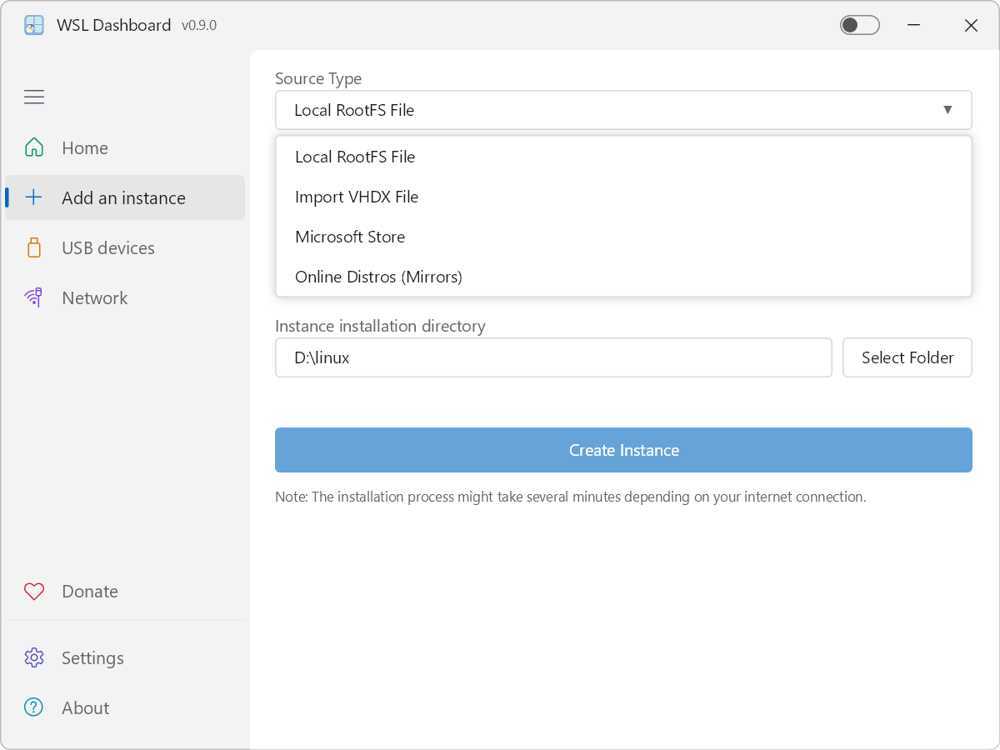
  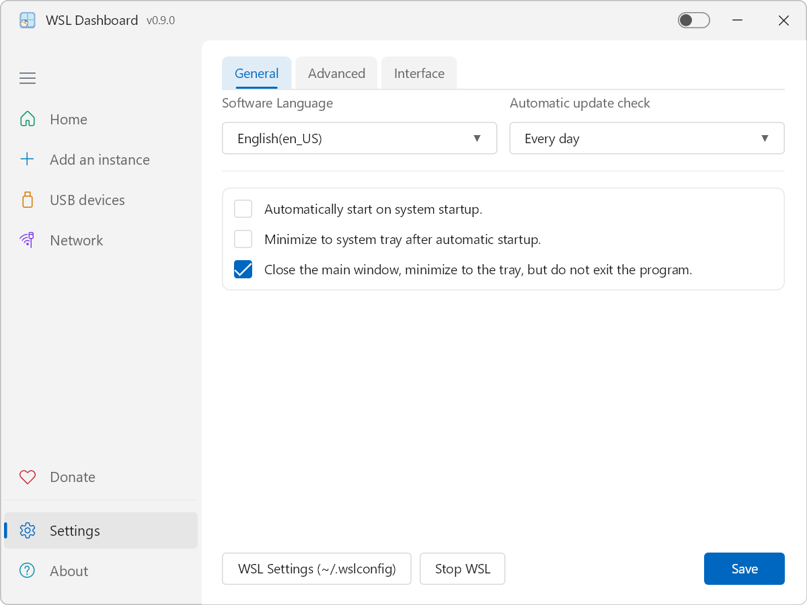
</p>
<p align="center">
  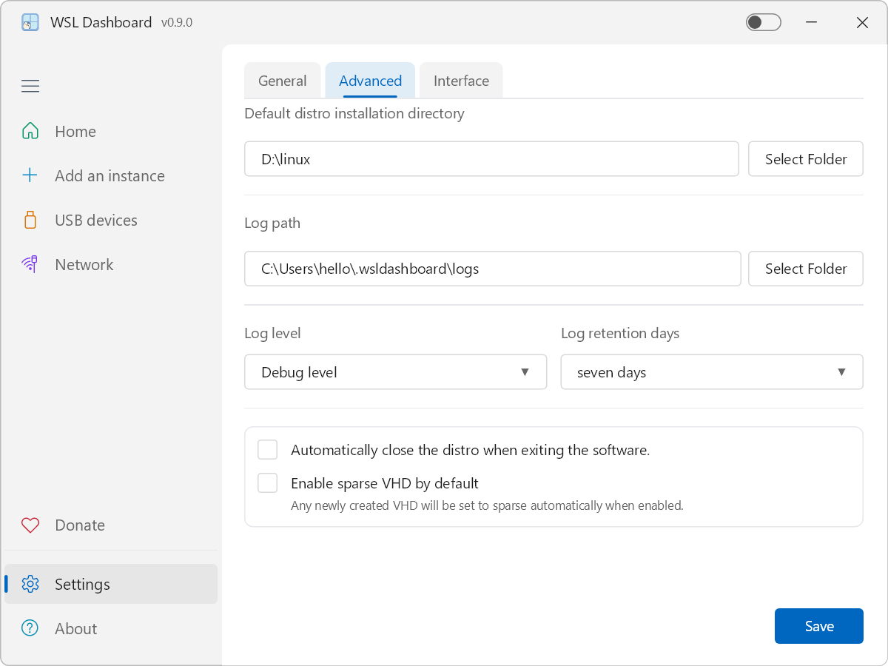
  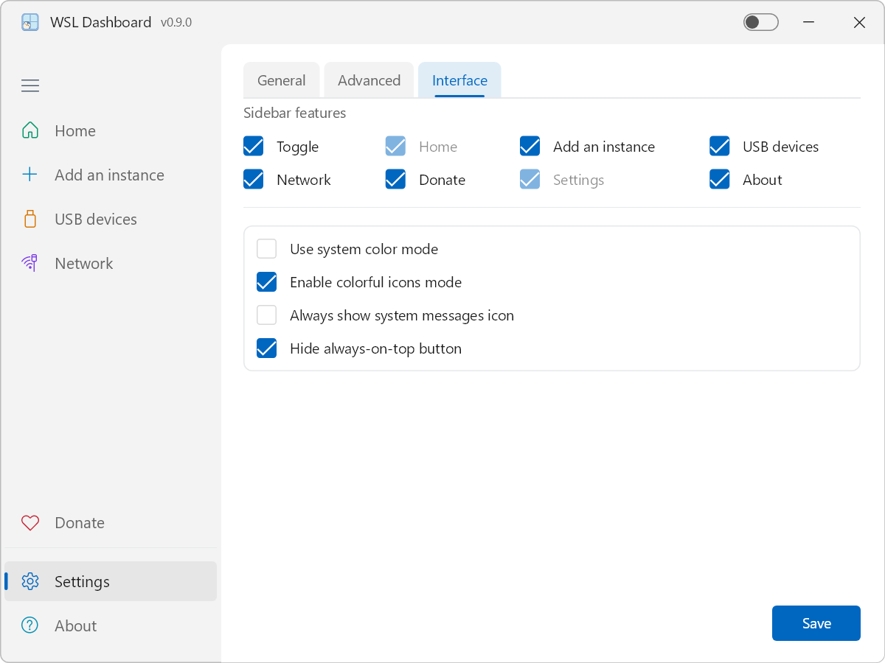
</p>

### Over & Doneren
<p align="center">
  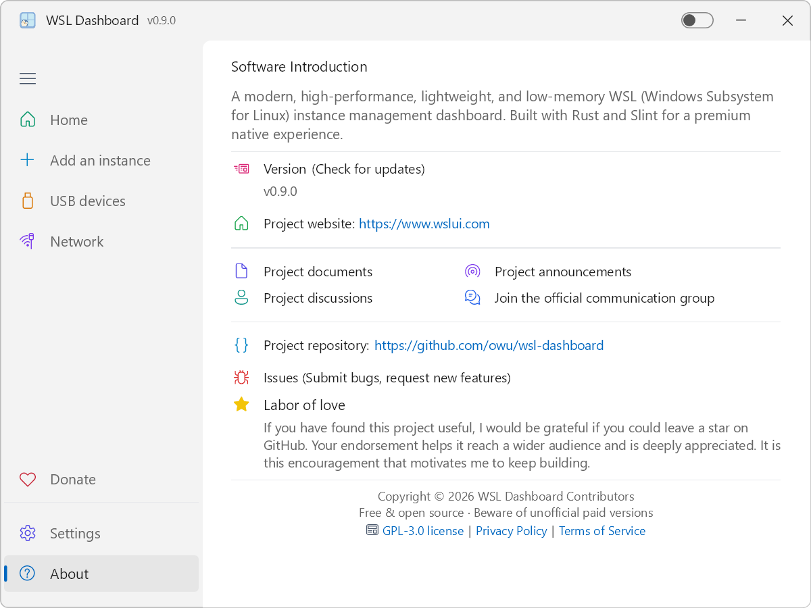
  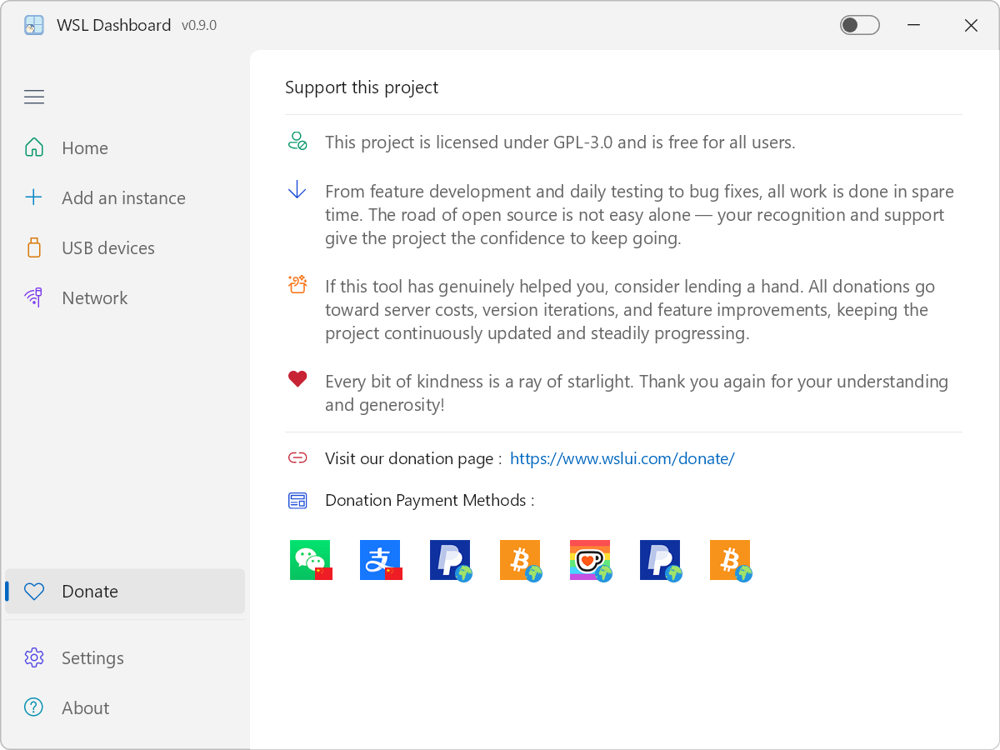
</p>

## 🎬 Demonstratie

[Help ons verbeteren! Bekijk onze introductievideo en deel uw mening.](https://github.com/owu/wsl-dashboard/discussions/9)


## 💻 Systeemvereisten

- Windows 10 of Windows 11 met WSL ingeschakeld (WSL 2 aanbevolen).
- Minimaal één WSL-distributie geïnstalleerd, of toestemming om nieuwe te installeren.
- 64-bit CPU; 4 GB RAM of meer aanbevolen voor soepel gebruik van meerdere distro's.

## 📦 Installatiehandleiding

### Optie 1: Download de voorgecompileerde binary

De eenvoudigste manier om aan de slag te gaan is door de voorgecompileerde release te gebruiken:

1. Ga naar de [GitHub Releases](https://github.com/owu/wsl-dashboard/releases) pagina.
2. Download het nieuwste `wsldashboard` uitvoerbare bestand voor Windows.
3. Pak het uit (indien verpakt) en voer `wsldashboard.exe` uit.

Er is geen installatieprogramma vereist; de app is een enkele draagbare binary.

### Optie 2: Bouwen vanuit de broncode

Zorg ervoor dat de Rust-toolchain (Rust 1.92 of nieuwer) is geïnstalleerd.

1. Kloon de repository:

   ```powershell
   git clone https://github.com/owu/wsl-dashboard.git
   cd wsl-dashboard
   ```

2. Bouwen en uitvoeren:

   - Voor ontwikkeling:

     ```powershell
     cargo run
     ```
   - Geoptimaliseerde release-build met het build-script:

     > Het build-script vereist de `x86_64-pc-windows-msvc` toolchain.

     ```powershell
     .\build\portable\build.ps1
     ```


## 🛠️ Tech Stack & Prestaties

- **Kern**: Geïmplementeerd in Rust voor geheugenveiligheid en zero-cost abstracties.
- **UI Framework**: Slint met hoogwaardige **Skia** rendering backend.
- **Async Runtime**: Tokio voor niet-blokkerende systeemcommando's en I/O.
- **Prestatiehoogtepunten**:
  - **Responsiviteit**: Bijna onmiddellijke opstart en realtime WSL-statusbewaking.
  - **Efficiëntie**: Zeer laag bronnengebruik (zie [Belangrijkste kenmerken](#-belangrijkste-kenmerken--gebruik) voor details).
  - **Portabiliteit**: Geoptimaliseerde release-build produceert een enkele compacte executable.


## 🤝 Community Steun

Heel veel dank aan de volgende communities voor hun steun:

- [Rust Programming Language](https://www.rust-lang.org) - Voor de krachtige en veilige programmeertaal
- [Slint | Declarative GUI for Rust, C++, JavaScript & Python](https://slint.dev) - Voor het moderne UI-framework
- [WSL: Windows Subsystem for Linux](https://github.com/microsoft/WSL) - Voor het geweldige Windows Subsystem for Linux
- [Tokio - An asynchronous Rust runtime](https://tokio.rs) - Voor de efficiënte async runtime
- [Windows Developer Community](https://developer.microsoft.com/en-us/windows/community) - Voor continue platformverbeteringen
- [Reddit](https://www.reddit.com) - Voor wereldwijde community discussies en ondersteuning
- [Hacker News](https://news.ycombinator.com) - Voor wereldwijde community discussies en ondersteuning
- [Linux.do](https://linux.do) - Voor de populaire community voor IT-professionals
- [V2EX](https://www.v2ex.com) - Voor discussies in de Chinese techcommunity

Uw bijdragen en feedback maken dit project mogelijk！


## ❤️ Ondersteun dit project

- Dit project is gelicentieerd onder GPL-3.0 en is gratis voor alle gebruikers.
- Van functionaliteitsontwikkeling en dagelijkse tests tot bugfixes — al het werk wordt in de vrije tijd gedaan. De weg van open source is niet gemakkelijk alleen te bewandelen. Uw erkenning en steun geven het project het vertrouwen om door te gaan.
- Als deze tool u echt heeft geholpen, overweeg dan om een handje te helpen. Alle donaties gaan naar serverkosten, versie-updates en functionaliteitsverbeteringen, zodat het project continu wordt bijgewerkt en gestaag vooruitgaat.
- Elke kleine vriendelijkheid is een straal van sterrenlicht. Nogmaals bedankt voor uw begrip en vrijgevigheid！

Bezoek onze donatiepagina：[https://www.wslui.com/donate/](https://www.wslui.com/donate/)


## ⭐️ Liefdeswerk

Als u dit project nuttig heeft gevonden, zou ik het op prijs stellen als u een ster achterlaat op GitHub. Uw steun helpt het een breder publiek te bereiken en wordt zeer gewaardeerd. Het is deze aanmoediging die mij motiveert om door te gaan met bouwen.


## 📄 Licentie

Dit project is gelicenseerd onder de GPL-3.0 – zie het [LICENSE](../LICENSE) bestand voor details.


---

Built with ❤️ for the WSL Community.

